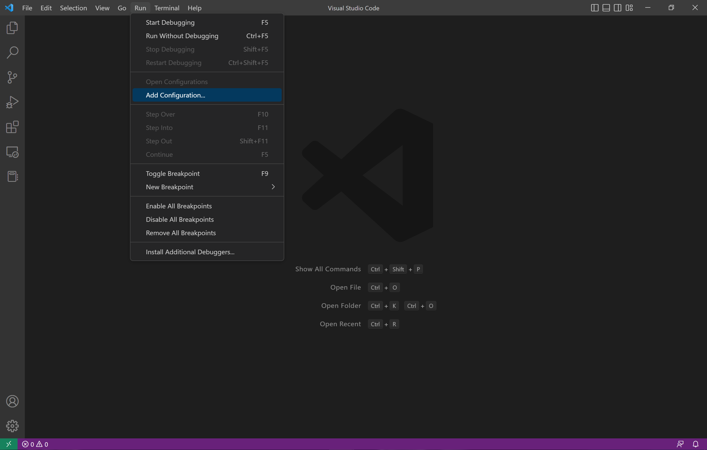
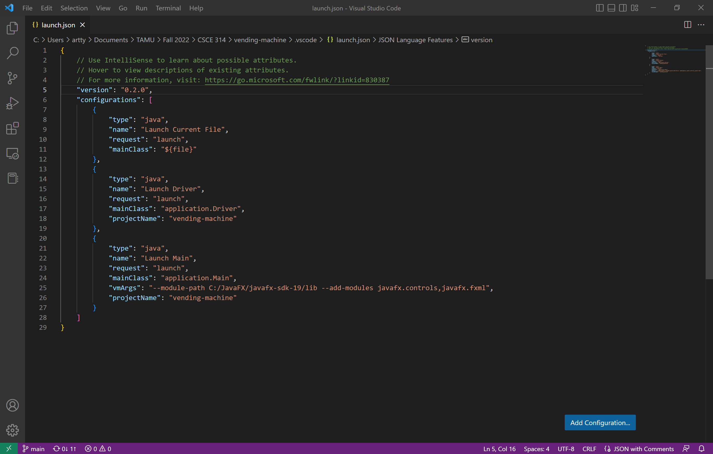
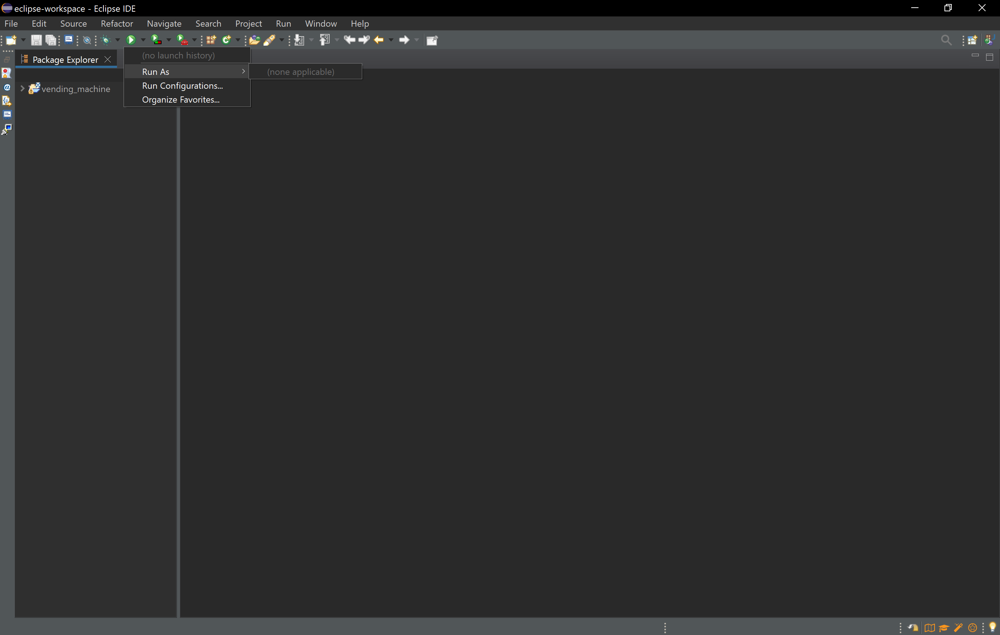
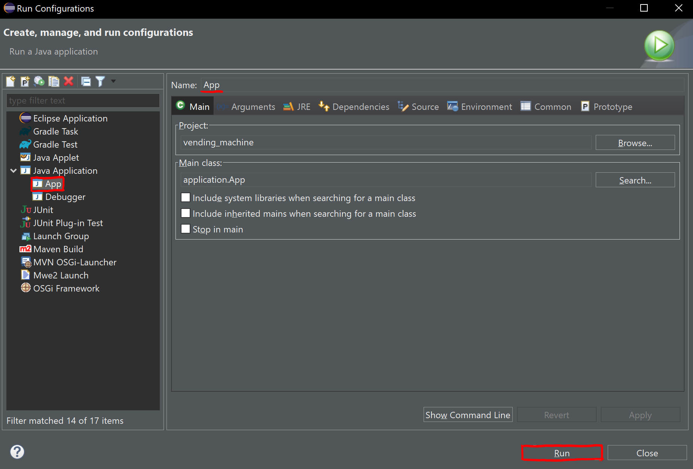

# Vending Machine

**Welcome to the Virtual Vending Machine!**

This application simulates the core functions of a vending machine. With this machine, you will be able to unload various items in addition to restock the machine when you feel necessary. The machine offers a UI that allows you, the user, to see both the items available in each slot of the machine in addition to the number of items present in that particular slot.

## Requirements

- java SE 11+
- javaFX

## How to Use

First clone this repository into your local directories. To do so, you may run the following in your desired directory in your terminal:

```sh
git clone https://github.com/Atsubyo/vending-machine.git && cd vending-machine
```

For a zipped package, extract the folder contents into your desired directory location.

Setup will be different for [Visual Studio Code](#visual-studio-code) and [Eclipse](#eclipse). For running and compilation, please refer to the [makefile documentation](#makefile) below.

### Visual Studio Code

1. Ensure that you have [Visual Studio Code](https://code.visualstudio.com/download) installed. Having the [Java Extension Pack](https://marketplace.visualstudio.com/items?itemName=vscjava.vscode-java-pack) is recommended.

2. Add Configurations
    

3. Ensure that your `.classpath` contains the correct file path to your javaFX installation.

    

4. Add proper vmArgs to your launch.json

    ```sh
    "vmArgs": "--module-path /file/path/to/javaFX/lib --add-modules javafx.controls,javafx.fxml"
    ```

    

5. Refer to the [makefile documentation](#makefile) for compilation.

#### As an alternative to makefile and terminal based compilation for `App.java`, you can run directly in Visual Studio Code with the Java Extension Pack

1. Open the `App.java` file nested in `src/application/App.java`.

### Eclipse

1. Ensure that you have [Eclipse IDE](https://www.eclipse.org/downloads/) installed. Having the [e(fx)clipse extension](https://www.eclipse.org/efxclipse/index.html) is recommended, but not necessary to run this application.

2. Add javaFX libraries and setup run configurations for `App.java`. Follow this [tutorial](https://youtu.be/bk28ytggz7E) to set that up.

3. Refer to the [makefile documentation](#makefile) for compilation.

#### As an alternative to makefile and terminal based compilation for `App.java`, you can run directly in the Eclipse IDE

1. Open the drop down menu on "Run".
    

2. Enter run configurations once again and go to the `App` item.

3. Select `run` in the bottom right fo the window
    

## Makefile

This application offers to main() components. There is the `Debugger.java` that is used for testing and debugging the logic within the application. To run the application with its GUI, you must run with `App.java` as the your main class. Use the makefile to differentiate which you want to run.

To compile `Debugger.java` as the main class:

```sh
make build-debug
```

Default testing/debugging with `Debugger.java` as the main class:

```sh
make run-debug
```

For testing/debugging with `Debugger.java` as the main class with your own choice of file:

```sh
make run-debug-args directoryFile inputFile
```

For running the application with `App.java` as the main class:

```sh
Not Available (Refer to the proceeding steps from earlier.)
```

## TODO

- [ ] Implement App.java Execution via Makefile
- [ ] Generate Working Executable .jar with Makefile
