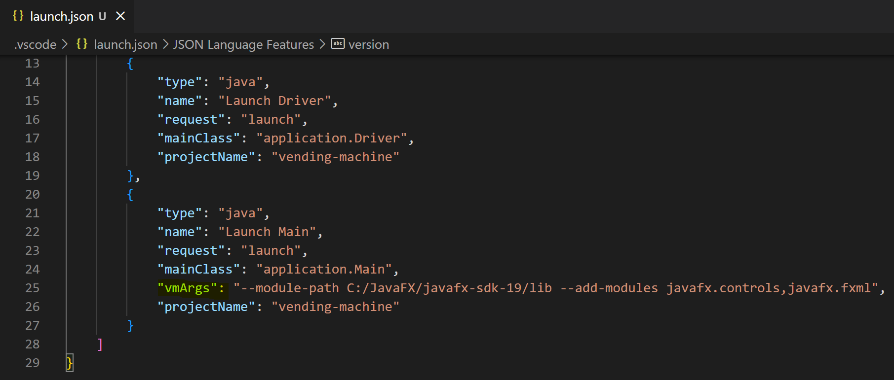

# Vending Machine

**Welcome to the Virtual Vending Machine!**

This application simulates the core functions of a vending machine. With this machine, you will be able to unload various items in addition to restock the machine when you feel necessary. The machine offers a UI that allows you, the user, to see both the items available in each slot of the machine in addition to the number of items present in that particular slot.

## Requirements

- java SE 11+
- javaFX

## How to Use

First clone this repository into your local directories. To do so, you may run the following in your desired directory in your terminal:
```
git clone https://github.com/Atsubyo/vending-machine.git && cd vending-machine
```

Setup will be different for Visual Studio Code and Eclipse. For running and compilation, please refer to the [makefile documentation](#makefile) below.

### Visual Studio Code

1. Add Configurations


2. Add proper vmArgs to your launch.json

```sh
"vmArgs": "--module-path /file/path/to/javaFX/lib --add-modules javafx.controls,javafx.fxml"
```



3. Refer to the [makefile documentation](#makefile) for compilation.

### Eclipse

1. Add javaFX libraries and setup run configurations for `Main.java`. Follow this [tutorial](https://youtu.be/bk28ytggz7E) to set that up.

2. [makefile documentation](#makefile) for compilation.

## Makefile

This application offers to main() components. There is the `Driver.java` that is used for testing and debugging the logic within the application. To run the application with its GUI, you must run with `Main.java` as the your main class. Use the makefile to differentiate which you want to run.

For testing/debugging with `Driver.java` as the main class:

```
make 
```

For running the application with `Main.java` as the main class:

```
make
```
