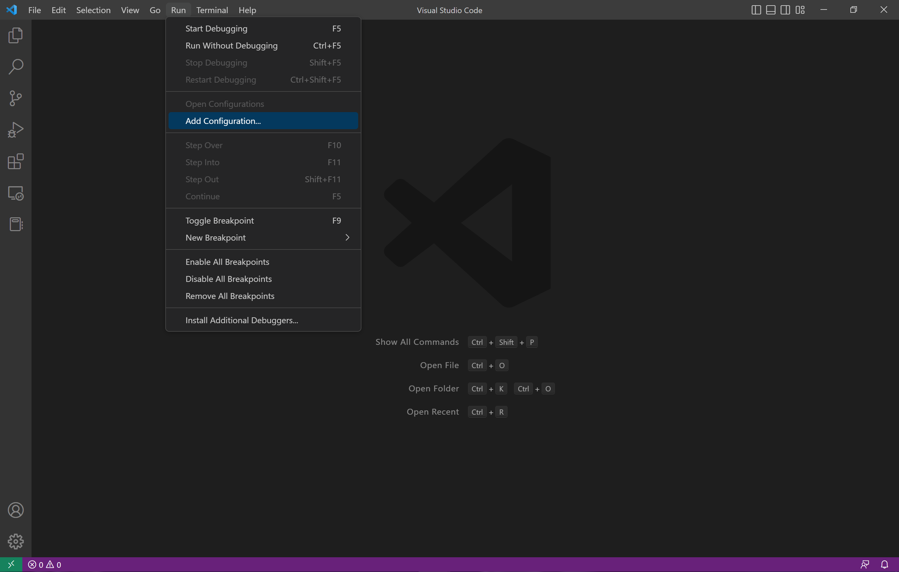

# Vending Machine

**Welcome to the Virtual Vending Machine!**

This application simulates the core functions of a vending machine. With this machine, you will be able to unload various items in addition to restock the machine when you feel necessary. The machine offers a UI that allows you, the user, to see both the items available in each slot of the machine in addition to the number of items present in that particular slot.

## Requirements

- javaFX

## How to Run

To run this program, you have a few options.

### vsCode

1. Add Configurations
`Run->Add Configurations`



2. Add proper vmArgs to your launch.json

```sh
"vmArgs": "--module-path C:/JavaFX/javafx-sdk-19/lib --add-modules javafx.controls,javafx.fxml"
```


